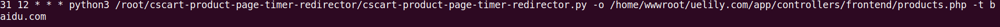

# cscart-product-page-timer-redirector

定时将cscart产品页面跳转到指定域名的定时工具

## 一些约定
1. 从A域名跳到B域名,那么A叫做源域名,B叫做目标域名

## 安装
1. 下载压缩包到源域名服务器
1. 解压放到任意目录,cscart-product-page-timer-redirector.py文件所在目录后文称之为工作目录
1. 安装python3
    1. CentOS: `yum install python3`
    1. Ubuntu: `apt-get install python3`
1. 替换products.php文件
    1. 找到解压后目录中的/cscart-files/cscart-4.3.2/app/controller/frontend/products.php
    1. 用此文件替换/home/wwwroot/a.com/app/controllers/frontend/products.php文件

## 使用
1. 进入源域名服务器用`crontab -e`打开计划任务配置文件
1. 使用每个跳转时段的起始时间设置生成跳转计划任务执行时间
    1. 比如我希望在0:00 - 3:30从A域名跳转到B域名,则计划任务执行时间为0:00
    1. 比如我希望在6:30 - 24:00从A域名跳转到C域名,则计划任务执行时间为6:30
    1. 以此类推,后文将之称之为执行时间
1. 编写计划任务
    1. 如任务为`0:30` - `4:00`从域名A(`a.com`)跳转到域名B(`b.com`),如果流量不是从google.com过来的,则跳转到域名D(`d.com`)
    1. cscart-product-page-timer-redirector.py所在的工作目录为`/root/cscart-product-page-timer-redirector/`
    1. 域名A所在的目录为/home/wwwroot/a.com
    1. 配置文件为 `30 0 * * * python3 /root/cscart-product-page-timer-redirector/cscart-product-page-timer-redirector.py -o /home/wwwroot/a.com/app/controllers/frontend/products.php -t http://b.com`
    1. 开头的`30 0`表示执行时间为在每天的0:30
    1. `/root/cscart-product-page-timer-redirector/cscart-product-page-timer-redirector.py`是cscart-product-page-timer-redirector.py的路径
    1. `-o /home/wwwroot/a.com/app/controllers/frontend/product.php`是A域名的product.php文件的路径
    1. `-t b.com`目标域名B
1. 所有计划任务填写好后,保存就生效了

## 配置截图

## Trouble shooting
1. cron不执行 
    1. 查看cron进程状态是否在运行中
    1. 查看/var/log/cron的日志中是否有报错